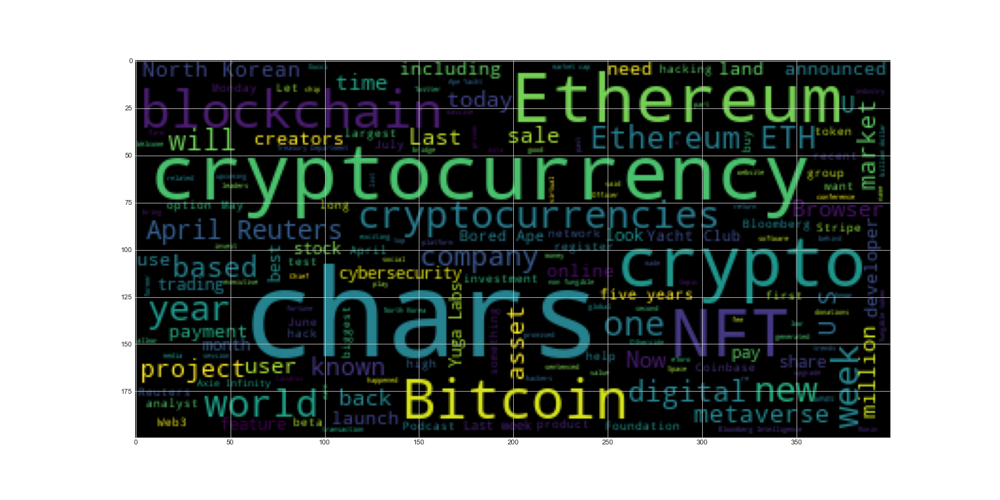
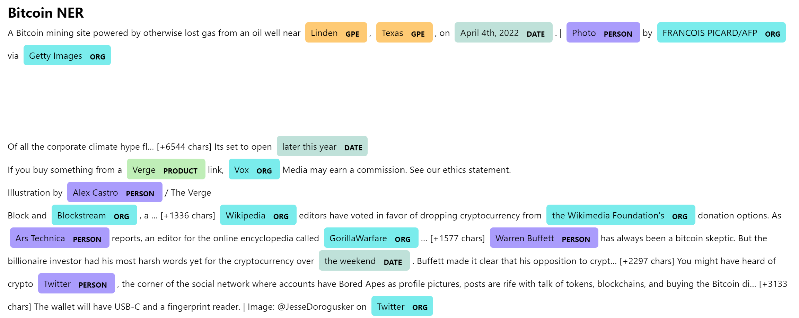
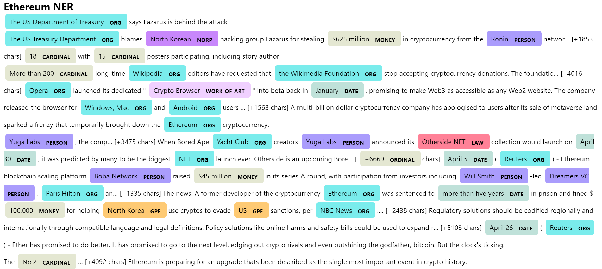

# Tales-from-the-Crypto

In this assignment, I applied natural language processing to do the Sentiment Analysis with the latest Bitcoin and Ethereum news. I also applied fundamental NLP techniques analyzed the other factors involved with the coin prices such as common words and phrases and organizations and entities mentioned in the articles.

## Sentiment Analysis

I used the [newsapi](https://newsapi.org/) to pull the latest news articles for Bitcoin and Ethereum and create a DataFrame of sentiment scores for each coin. I have the following findings:
1. Ethereum had the highest mean positive score which was 0.08748, while Bitcoin's mean positive score was 0.06501.
2. Ethereum had the highest mean compound score which was 0.191045, while Bitcoin's mean compound score was 0.144785. Both Bitcoin and Ethereum's max compound scores were 0.952.
3. Ethereum and Bitcoin had the same max positive score which was 0.378.
4. Ethereum had the highest mean negative score which was 0.03816, while Bitcoin's mean negative score was 0.03212.
5. Bitcoin had the highest max negative score which was 0.329, while Ethereum's max negative score was 0.233. 

## Natural Language Processing

I used NLTK and Python to tokenize text, find n-gram counts, and create word clouds for both coins. 
- Bitcoin's top 10  most common 2-word phrases are: 
            [(('april', 'reuters'), 19),
            (('char', 'april'), 6),
            (('may', 'reuters'), 6),
            (('bitcoin', 'conference'), 5),
            (('warren', 'buffett'), 4),
            (('cash', 'app'), 4),
            (('central', 'african'), 4),
            (('char', 'london'), 4),
            (('char', 'new'), 4),
            (('wikipedia', 'editor'), 3)]

 - Ethereum's top 10 most common 2-word phrases are:
            [(('april', 'reuters'), 8),
            (('char', 'april'), 7),
            (('north', 'korean'), 6),
            (('yacht', 'club'), 5),
            (('five', 'year'), 5),
            (('char', 'us'), 5),
            (('last', 'week'), 4),
            (('axie', 'infinity'), 4),
            (('bloomberg', 'intelligence'), 4),
            (('us', 'treasury'), 3)]

- Bitcoin' top 10 words are:
            [('char', 96),
            ('bitcoin', 48),
            ('reuters', 29),
            ('april', 23),
            ('ha', 22),
            ('cryptocurrency', 21),
            ('crypto', 16),
            ('world', 16),
            ('cryptocurrencies', 14),
            ('may', 12)]

- Ethereum's top 10 words are:
            [('char', 100),
            ('ha', 27),
            ('cryptocurrency', 24),
            ('ethereum', 22),
            ('crypto', 18),
            ('year', 15),
            ('week', 15),
            ('us', 13),
            ('wa', 13),
            ('april', 12)]

Finally, generated word clouds for each coin to summarize the news for each coin.

## Named Entity Recognition

I build a named entity recognition model for both coins and visualize the tags using SpaCy.

